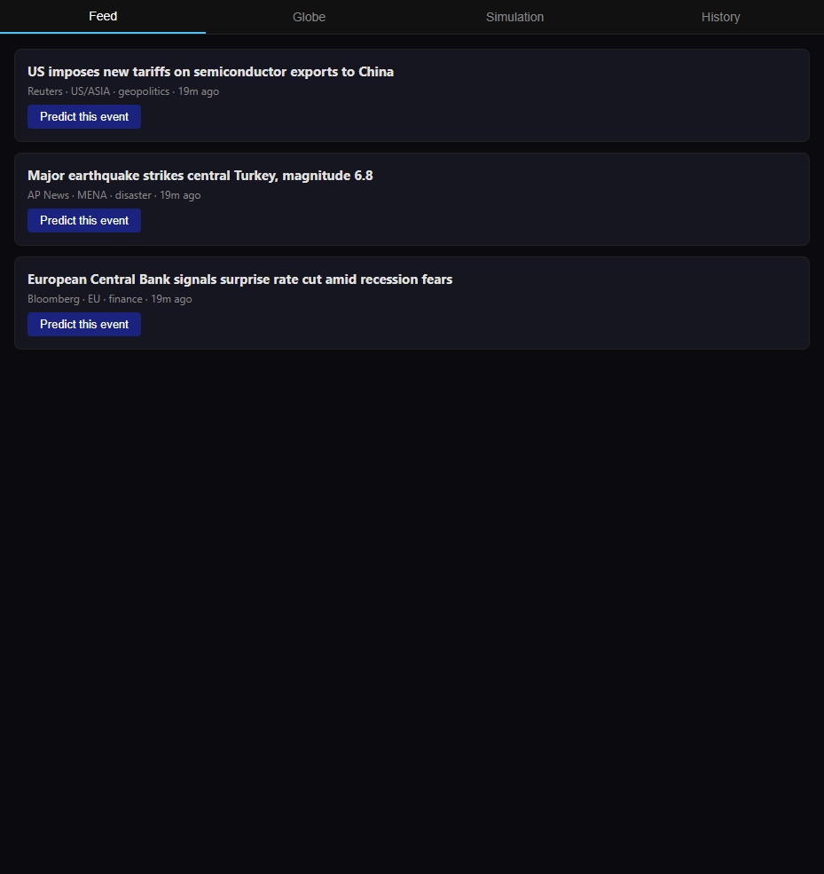
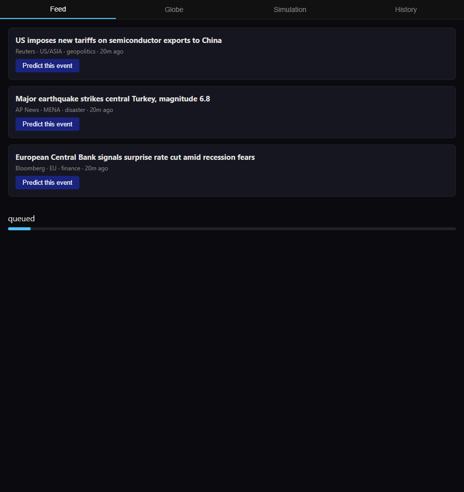
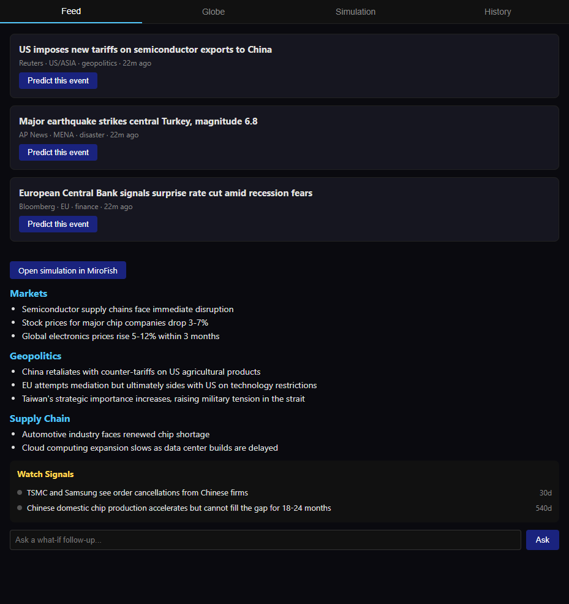
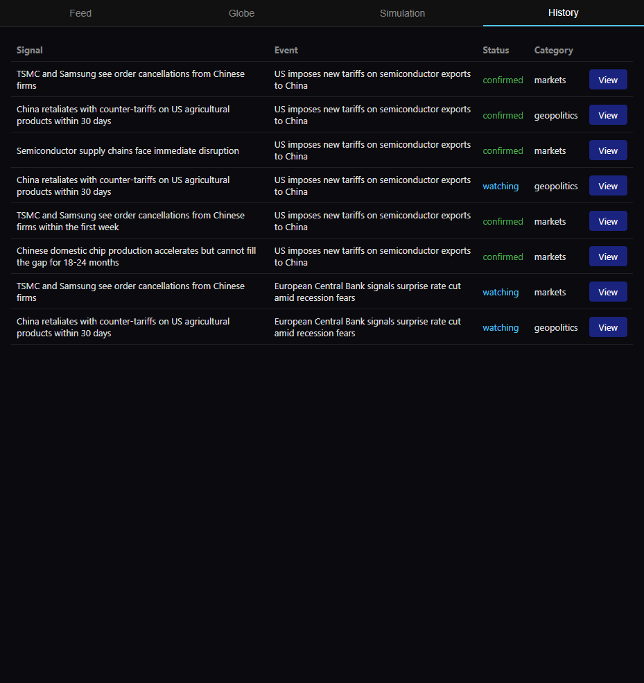

# Worldcast 🌍

> **Point at a live world event. Get a simulation of what happens next. Get notified when it comes true.**

Worldcast bridges two open-source projects — a real-time global intelligence dashboard and a multi-agent AI simulation engine — into a single tool that predicts the downstream effects of real-world events, then watches the news to tell you when those predictions actually happen.

[](https://www.gnu.org/licenses/agpl-3.0)
[](https://docker.com)
[](https://nodejs.org)

---

## Screenshots

| Live feed | Prediction in progress | Report + watch signals | History |
|---|---|---|---|
|  |  |  |  |

---

## What it does

1. **Monitor** — WorldMonitor aggregates 435+ live news feeds, geopolitical signals, and financial data onto a real-time 3D globe
2. **Select** — Pick any event, click "Predict this event"
3. **Simulate** — MiroFish spawns thousands of AI agents with memory and personality, runs a social simulation seeded by that event
4. **Report** — Plain-English bullets across markets, geopolitics, supply chain — plus a checklist of specific verifiable signals to watch for
5. **Notify** — The bridge continuously scans incoming WorldMonitor events against your open watch signals. When reality matches a prediction, you get a browser notification

```
Live event → Simulate → Report + Watch signals
                                      ↓
              New events → Matcher → 🔔 "Your prediction came true"
```

---

## Architecture

```
┌──────────────────────────────────────────────────────────────────┐
│                        YOUR UI  :3333                            │
│   Feed Tab │ Globe Tab (iframe) │ Sim Tab (iframe) │ History Tab │
│                                                                  │
│   Report Panel               Watch Signals Panel                 │
│   ──────────────             ─────────────────────────           │
│   • markets                  □ TSMC drops >3% · 5 days    🔔    │
│   • geopolitics              □ China counter-tariffs · 90d 🔔   │
│   • supply chain             □ Vietnam FDI spike · Q3     🔔    │
│                              [ ✓ happened ] [ ✗ didn't ]        │
└──────┬───────────────────────────────────┬───────────────────────┘
       │ POST /predict                     │ WS: progress, report,
       │                                   │     match alerts 🔔
       ▼                                   │
┌──────────────────────────────────────────────────────────────────┐
│                       BRIDGE  :4000                              │
│                                                                  │
│  formatter.js  ── shapes WM event → MF seed                      │
│  jobs.js       ── fires sim, polls status, streams progress      │
│  summarizer.js ── raw MF report → plain English + signals        │
│  watchlist.js  ── stores open signals, expiry, match rules       │
│  matcher.js    ── NEW: polls WM feed, scores against signals     │
│  notifier.js   ── NEW: pushes WS alert when match found          │
└──────┬────────────────────────────────────┬───────────────────────┘
       │                                    │
       ▼                                    ▼
┌─────────────────┐               ┌─────────────────────┐
│  WorldMonitor   │               │      MiroFish       │
│    :5173        │◄─ matcher     │   :5001 / :3000     │
│  (Docker image) │   polls       │   (Docker image)    │
│                 │   every 60s   │                     │
│  GET /api/events│               │  POST /api/simulate │
└─────────────────┘               └──────────┬──────────┘
                                             │
                                  ┌──────────▼──────────┐
                                  │      LLM API        │
                                  │  qwen / ollama      │
                                  │  (user's own key)   │
                                  └─────────────────────┘
```

**You only write and maintain:**
- `bridge/` — ~250 lines Node.js (6 small modules)
- `ui/` — ~180 lines HTML (single file)

WorldMonitor and MiroFish run as Docker images pulled from their registries. You never touch their code. When they update: `docker compose pull`.

---

## How the notification loop works

```
Every 60 seconds:
  matcher.js polls WorldMonitor GET /api/events (last 60s of news)
      │
      ▼
  For each open watch signal in watchlist:
      score = LLM.match(incoming_event, signal_text)
      if score > 0.8 → signal.status = "confirmed"
                    → notifier.push(WS alert to UI)
                    → UI shows 🔔 banner + marks checkbox green
      if signal.expires_at < now → signal.status = "expired"
```

The matcher uses a lightweight LLM call — just semantic similarity between the incoming headline and the watch signal text. Cheap, fast, runs every minute.

---

## The watch signals feature

Every prediction report ends with 3–5 specific, verifiable, time-bound signals:

```
WATCH FOR THESE SIGNALS                status
━━━━━━━━━━━━━━━━━━━━━━━━━━━━━━━━━━━━━━━━━━━━━
□  TSMC stock drops >3%                watching · expires 5 days
□  China announces counter-tariffs     watching · expires 90 days
□  Vietnam FDI announcements spike     watching · expires Q3
□  CHIPS Act discussion resurfaces     watching · expires Q2

Last scanned: 2 min ago
```

When a match fires:

```
🔔  PREDICTION CONFIRMED
    "China announces agricultural counter-tariffs"
    matched incoming:
    "Beijing announces retaliatory tariffs on US soybeans" · Reuters · 14 min ago

    [ view event ]  [ view original prediction ]
```

---

## Quick start

### Prerequisites

| Tool | Version | Notes |
|------|---------|-------|
| Docker Desktop | latest | `docker --version` |
| Node.js | 18+ | `node --version` |
| LLM API key | — | [Alibaba Bailian](https://bailian.console.aliyun.com/) — qwen-plus, free tier |
| Zep Cloud | free tier | [app.getzep.com](https://app.getzep.com) — agent memory |

### Install

```bash
git clone https://github.com/wilson-cheng1110/WorldPredict
cd WorldPredict
cp .env.example .env       # fill in your 3 API keys (5 min)
docker compose up
```

Open [localhost:3333](http://localhost:3333). Allow browser notifications when prompted.

### Update

```bash
docker compose pull        # pulls latest WorldMonitor + MiroFish
docker compose up -d       # restarts with new versions
```

---

## Environment variables

```bash
# LLM — any OpenAI-compatible API
LLM_API_KEY=your_key
LLM_BASE_URL=https://dashscope.aliyuncs.com/compatible-mode/v1
LLM_MODEL_NAME=qwen-plus

# Zep Cloud — agent long-term memory
ZEP_API_KEY=your_zep_key

# Bridge internals (defaults work, change if needed)
BRIDGE_PORT=4000
WM_URL=http://worldmonitor:5173
MF_API_URL=http://mirofish-api:5001
MF_UI_URL=http://mirofish-ui:3000
MATCH_POLL_INTERVAL_MS=60000
MATCH_CONFIDENCE_THRESHOLD=0.8
SIGNAL_DEFAULT_EXPIRY_DAYS=90
```

---

## Project structure

```
worldcast/
├── docker-compose.yml       one command boots everything
├── .env.example             all keys documented
├── bridge/
│   ├── index.js             Express + WebSocket server
│   ├── formatter.js         WM event → MF seed document
│   ├── jobs.js              fire sim, poll, stream progress
│   ├── summarizer.js        raw report → bullets + watch signals
│   ├── watchlist.js         store/retrieve open signals
│   ├── matcher.js           poll WM feed, score vs signals
│   └── notifier.js          push WS alerts to UI clients
├── ui/
│   └── index.html           all 4 tabs + notification UI
└── docs/
    └── index.html           GitHub Pages landing page
```

---

## Limitations

- Predictions are probabilistic narratives, not statistical forecasts. Scenario planning, not financial advice.
- Simulation quality scales with seed richness. Sparse events → weaker simulations.
- Each simulation takes 5–15 min and consumes significant LLM tokens. Start with <40 rounds.
- The matcher uses semantic similarity, not fact verification. A matching headline signals confirmation — human judgement still needed.

---

## What to do next (resume checklist)

The bridge code is built but needs a rewrite to match the **real** APIs discovered during testing. Here's what's blocking and what to do:

### 1. Restart your machine
Docker Desktop was just installed via `winget` but needs a reboot to enable WSL2/Hyper-V.

### 2. Get a Zep Cloud API key (free)
- Sign up at [app.getzep.com](https://app.getzep.com)
- Copy your API key
- Paste it into `.env` as `ZEP_API_KEY=your_real_key`
- MiroFish's graph building, simulation, and reports all require Zep Cloud (confirmed: 401 without it)

### 3. After reboot: start Docker Desktop and run WorldMonitor
```bash
cd ../worldmonitor
cp .env.example .env.local    # optionally add GROQ_API_KEY for AI summaries
docker compose up -d --build
# Then seed data:
./scripts/run-seeders.sh
```
WorldMonitor's API only works with the full Docker stack (Redis + API server).

### 4. Rewrite the bridge for real APIs
The CLAUDE.md assumed simple `POST /api/simulate` + `GET /api/events` but reality is:

**MiroFish** (confirmed by testing):
- 7-step async workflow: ontology generate -> graph build -> sim create -> prepare -> start -> report generate -> get report
- Ontology generation works with Ollama/llama3 (tested successfully)
- All steps after ontology require Zep Cloud

**WorldMonitor**:
- No `GET /api/events` endpoint — has 30+ specialized services (`/api/news/v1/...`, `/api/conflict/v1/...`, etc.)
- Matcher needs to aggregate from `/api/news/v1/list-feed-digest` and `/api/intelligence/v1/list-cross-source-signals`

Files that need rewriting: `formatter.js`, `jobs.js` (+ new `mf-client.js`), `matcher.js`.
Files that are fine: `watchlist.js`, `notifier.js`, `llm.js`, `summarizer.js` (minor prompt tweak).

### 5. Test end-to-end
```bash
# MiroFish (runs natively, no Docker needed)
cd ../MiroFish/backend && python run.py

# Bridge
cd bridge && node --env-file=../.env index.js

# UI (or use any static server on :3333)
# open ui/index.html
```

### Current working state
| Component | Status |
|-----------|--------|
| Bridge skeleton (all 7 modules) | Built, needs API rewrite |
| UI (single HTML, 4 tabs, WS, notifications) | Built, functional |
| docker-compose.yml | Built |
| MiroFish backend | Tested running on Python 3.11 + Ollama |
| WorldMonitor | Cloned, needs Docker for API |
| Docker Desktop | Installed, needs reboot |
| Zep Cloud | **MISSING** - need free API key |

---

## License

AGPL-3.0 — free to use, modify, distribute. Keep it open source.

WorldMonitor © Elie Habib — AGPL-3.0
MiroFish © 666ghj / Shanda Group — AGPL-3.0
