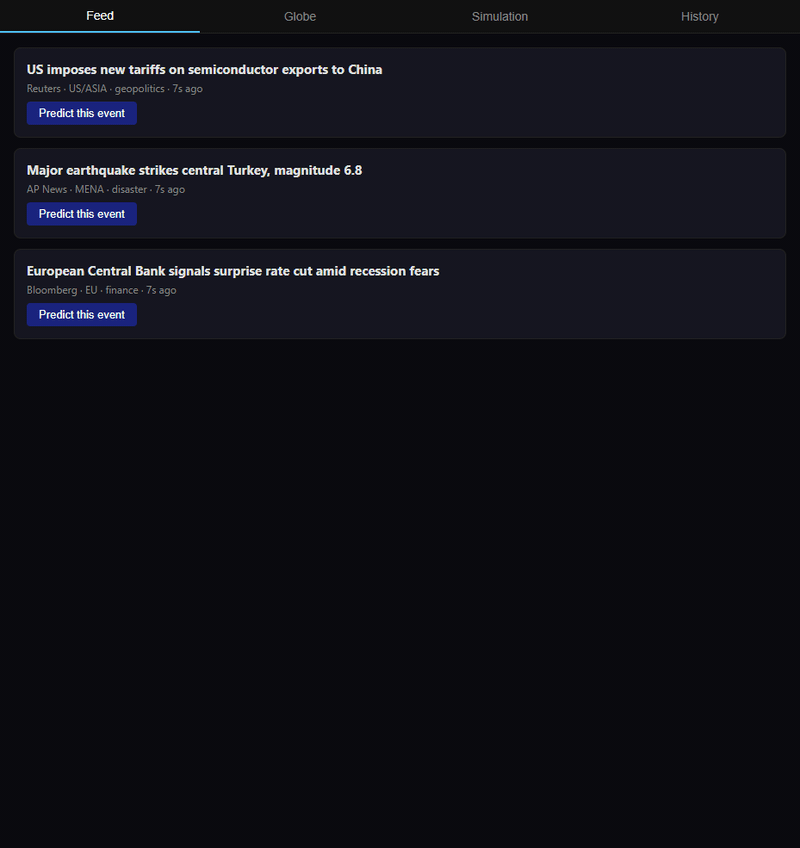

# Worldcast 🌍

> **Point at a live world event. Get a simulation of what happens next. Get notified when it comes true.**

Worldcast bridges two open-source projects — a real-time global intelligence dashboard and a multi-agent AI simulation engine — into a single tool that predicts the downstream effects of real-world events, then watches the news to tell you when those predictions actually happen.

[](https://www.gnu.org/licenses/agpl-3.0)
[](https://nodejs.org)
[](#quick-start--see-it-running-in-2-minutes)

---

## Demo



The full loop: pick a live event → simulated prediction renders with markets / geopolitics / supply-chain bullets and watch signals → an incoming news event confirms one of those signals and a banner appears at the top. Runs against the included mocks, no Docker required — [try it in 2 minutes ↓](#quick-start--see-it-running-in-2-minutes).

---

## What it does

1. **Monitor** — WorldMonitor aggregates 435+ live news feeds, geopolitical signals, and financial data onto a real-time 3D globe
2. **Select** — Pick any event, click "Predict this event"
3. **Simulate** — MiroFish spawns thousands of AI agents with memory and personality, runs a social simulation seeded by that event
4. **Report** — Plain-English bullets across markets, geopolitics, supply chain — plus a checklist of specific verifiable signals to watch for
5. **Notify** — The bridge continuously scans incoming WorldMonitor events against your open watch signals. When reality matches a prediction, you get a browser notification

```
Live event → Simulate → Report + Watch signals
                                      ↓
              New events → Matcher → 🔔 "Your prediction came true"
```

---

## Architecture

```
┌──────────────────────────────────────────────────────────────────┐
│                        YOUR UI  :3333                            │
│   Feed Tab │ Globe Tab (iframe) │ Sim Tab (iframe) │ History Tab │
│                                                                  │
│   Report Panel               Watch Signals Panel                 │
│   ──────────────             ─────────────────────────           │
│   • markets                  □ TSMC drops >3% · 5 days    🔔    │
│   • geopolitics              □ China counter-tariffs · 90d 🔔   │
│   • supply chain             □ Vietnam FDI spike · Q3     🔔    │
│                              [ ✓ happened ] [ ✗ didn't ]        │
└──────┬───────────────────────────────────┬───────────────────────┘
       │ POST /predict                     │ WS: progress, report,
       │                                   │     match alerts 🔔
       ▼                                   │
┌──────────────────────────────────────────────────────────────────┐
│                       BRIDGE  :4000                              │
│                                                                  │
│  formatter.js  ── shapes WM event → MF seed                      │
│  jobs.js       ── fires sim, polls status, streams progress      │
│  summarizer.js ── raw MF report → plain English + signals        │
│  watchlist.js  ── stores open signals, expiry, match rules       │
│  matcher.js    ── NEW: polls WM feed, scores against signals     │
│  notifier.js   ── NEW: pushes WS alert when match found          │
└──────┬────────────────────────────────────┬───────────────────────┘
       │                                    │
       ▼                                    ▼
┌─────────────────┐               ┌─────────────────────┐
│  WorldMonitor   │               │      MiroFish       │
│    :5173        │◄─ matcher     │   :5001 / :3000     │
│  (Docker image) │   polls       │   (Docker image)    │
│                 │   every 60s   │                     │
│  GET /api/events│               │  POST /api/simulate │
└─────────────────┘               └──────────┬──────────┘
                                             │
                                  ┌──────────▼──────────┐
                                  │      LLM API        │
                                  │  qwen / ollama      │
                                  │  (user's own key)   │
                                  └─────────────────────┘
```

**You only write and maintain:**
- `bridge/` — ~250 lines Node.js (6 small modules)
- `ui/` — ~180 lines HTML (single file)

WorldMonitor and MiroFish run as Docker images pulled from their registries. You never touch their code. When they update: `docker compose pull`.

---

## How the notification loop works

```
Every 60 seconds:
  matcher.js polls WorldMonitor GET /api/events (last 60s of news)
      │
      ▼
  For each open watch signal in watchlist:
      score = LLM.match(incoming_event, signal_text)
      if score > 0.8 → signal.status = "confirmed"
                    → notifier.push(WS alert to UI)
                    → UI shows 🔔 banner + marks checkbox green
      if signal.expires_at < now → signal.status = "expired"
```

The matcher uses a lightweight LLM call — just semantic similarity between the incoming headline and the watch signal text. Cheap, fast, runs every minute.

---

## The watch signals feature

Every prediction report ends with 3–5 specific, verifiable, time-bound signals:

```
WATCH FOR THESE SIGNALS                status
━━━━━━━━━━━━━━━━━━━━━━━━━━━━━━━━━━━━━━━━━━━━━
□  TSMC stock drops >3%                watching · expires 5 days
□  China announces counter-tariffs     watching · expires 90 days
□  Vietnam FDI announcements spike     watching · expires Q3
□  CHIPS Act discussion resurfaces     watching · expires Q2

Last scanned: 2 min ago
```

When a match fires:

```
🔔  PREDICTION CONFIRMED
    "China announces agricultural counter-tariffs"
    matched incoming:
    "Beijing announces retaliatory tariffs on US soybeans" · Reuters · 14 min ago

    [ view event ]  [ view original prediction ]
```

---

## Quick start — see it running in 2 minutes

The fastest way to try Worldcast is **mock mode**: the bridge + UI talk to a local stub of WorldMonitor and MiroFish, so you don't need Docker, the real upstream images, a Zep Cloud account, or an LLM key beyond a local Ollama.

**Requirements:** Node.js 18+ and (optionally) [Ollama](https://ollama.com) with any small model pulled (`ollama pull llama3`). If Ollama isn't running, predictions just return empty summaries — everything else still works.

```bash
git clone https://github.com/wilson-cheng1110/WorldPredict
cd WorldPredict
cp .env.example .env            # default values are fine for mock mode
npm install                      # installs bridge + test deps (~2 min)
npm run quickstart               # boots mocks, bridge, UI all at once
```

Open **<http://localhost:3333>**. You'll see three sample events. Click "Predict this event" on any of them — the progress bar runs through `queued → building world model → summarizing → complete`, then a report panel appears with Markets / Geopolitics / Supply Chain bullets and a checklist of watch signals.

To watch the notification loop fire, inject a confirming event into the mock WM:

```bash
curl -X POST http://localhost:5173/inject -H "Content-Type: application/json" -d '{
  "id":"wm_demo","title":"Confirming event matches your signal",
  "description":"...","source":"Demo","published_at":"2026-05-11T00:00:00Z",
  "region":"TEST","category":"markets","url":"https://example.com"
}'
```

Within 60 seconds the matcher cycle picks it up and you get a browser notification.

Ctrl-C in the quickstart terminal tears everything down.

### Tests

```bash
npm test                    # unit tests + MF-direct tests (fast, <10s)
npm run test:integration    # full loop against the running mock stack
```

### Real-stack mode (advanced)

Running against the actual WorldMonitor and MiroFish containers is **not yet a one-command experience**. The Docker images aren't published on a public registry, so you'd need to:

1. Clone [koala73/worldmonitor](https://github.com/koala73/worldmonitor) and [666ghj/MiroFish](https://github.com/666ghj/MiroFish) as siblings of this repo and build them locally
2. Get a free [Zep Cloud](https://app.getzep.com) API key (MiroFish requires it for graph + simulation steps)
3. Adjust `docker-compose.yml` to `build: ../worldmonitor` / `build: ../MiroFish/backend` instead of `image:`
4. Get an LLM key — [Alibaba Bailian](https://bailian.console.aliyun.com/) qwen-plus is free tier; OpenAI also works

See [ROADMAP.md](ROADMAP.md) for the state of real-stack support.

---

## Environment variables

```bash
# LLM — any OpenAI-compatible API
LLM_API_KEY=your_key
LLM_BASE_URL=https://dashscope.aliyuncs.com/compatible-mode/v1
LLM_MODEL_NAME=qwen-plus

# Zep Cloud — agent long-term memory
ZEP_API_KEY=your_zep_key

# Bridge internals (defaults work, change if needed)
BRIDGE_PORT=4000
WM_URL=http://worldmonitor:5173
MF_API_URL=http://mirofish-api:5001
MF_UI_URL=http://mirofish-ui:3000
MATCH_POLL_INTERVAL_MS=60000
MATCH_CONFIDENCE_THRESHOLD=0.8
SIGNAL_DEFAULT_EXPIRY_DAYS=90
```

---

## Project structure

```
worldcast/
├── package.json             root npm scripts (quickstart, test)
├── docker-compose.yml       real-stack composition (see ROADMAP.md)
├── .env.example             all keys documented
├── scripts/
│   └── quickstart.mjs       boots mocks + bridge + UI in one process
├── bridge/
│   ├── index.js             Express + WebSocket server
│   ├── formatter.js         WM event → MF seed document
│   ├── jobs.js              fire sim, poll, stream progress
│   ├── summarizer.js        raw report → bullets + watch signals
│   ├── watchlist.js         store/retrieve open signals
│   ├── matcher.js           poll WM feed, score vs signals
│   └── notifier.js          push WS alerts to UI clients
├── ui/
│   └── index.html           all 4 tabs + notification UI
├── test/
│   ├── mock-services.js     stub WorldMonitor + MiroFish
│   ├── unit.test.js         node:test, pure-function coverage
│   ├── mf-direct.test.js    contract test against mock MF
│   └── integration.test.js  POST /predict → WS → signal_confirmed
└── docs/
    ├── index.html           GitHub Pages landing page
    └── screenshots/         README assets
```

---

## Limitations

- Predictions are probabilistic narratives, not statistical forecasts. Scenario planning, not financial advice.
- Simulation quality scales with seed richness. Sparse events → weaker simulations.
- Each simulation takes 5–15 min and consumes significant LLM tokens. Start with <40 rounds.
- The matcher uses semantic similarity, not fact verification. A matching headline signals confirmation — human judgement still needed.

---

## License

AGPL-3.0 — free to use, modify, distribute. Keep it open source.

WorldMonitor © Elie Habib — AGPL-3.0
MiroFish © 666ghj / Shanda Group — AGPL-3.0
